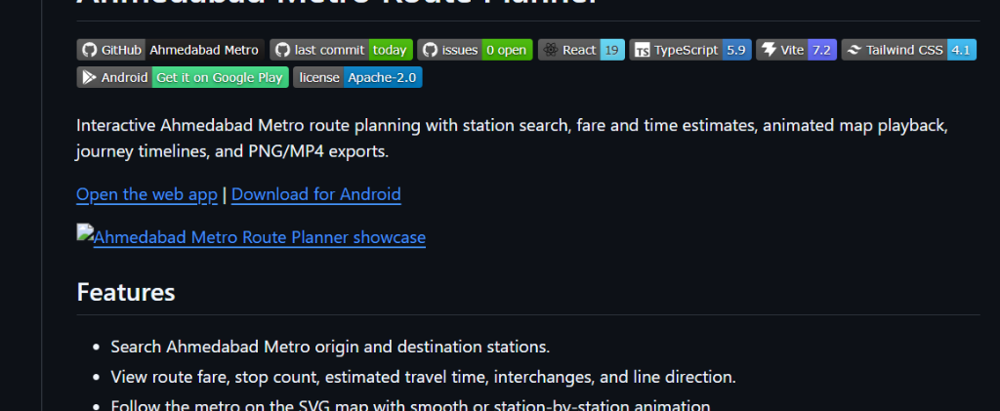
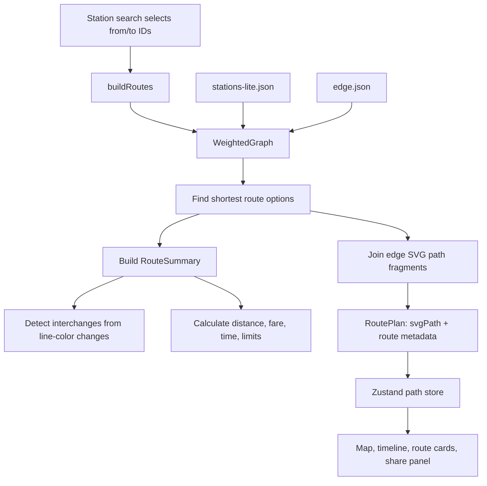
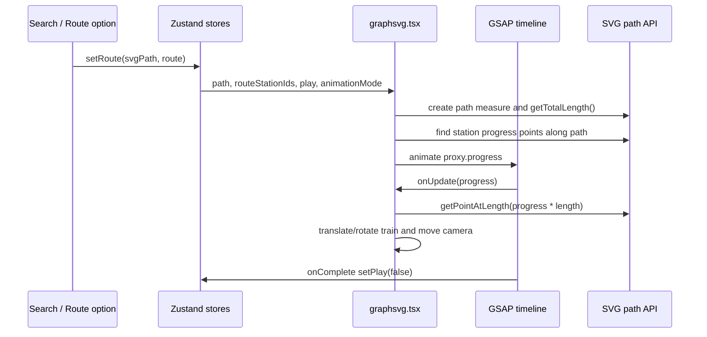
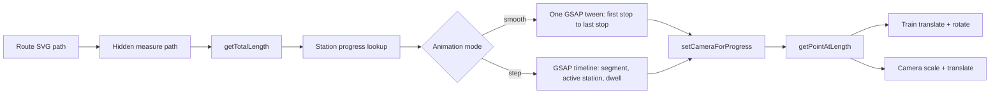

# Ahmedabad Metro Route Planner

[](https://github.com/Gap0507/Ahmedabad-Metro-FareCalculator)
[](https://github.com/Gap0507/Ahmedabad-Metro-FareCalculator/commits/main)
[](https://github.com/Gap0507/Ahmedabad-Metro-FareCalculator/issues)
[](https://nextjs.org/)
[](https://www.typescriptlang.org/)
[](https://tailwindcss.com/)
[](#license)

Interactive Ahmedabad Metro route planning with station search, fare and time estimates, animated map playback, journey timelines, and PNG/MP4 exports.

[Open the web app](https://ahmedabad-metro-fare-calculator.vercel.app/)



## Features

- Search Ahmedabad Metro origin and destination stations.
- View route fare, stop count, estimated travel time, interchanges, and line direction.
- Follow the metro on the SVG map with smooth or station-by-station animation.
- Choose route camera zoom levels for map playback and video export.
- Export the journey timeline as PNG.
- Export the animated metro route as MP4 using Mediabunny.

## How Routing Works

Routing is implemented in `src/utils/routePlanner.ts` as a weighted graph over station IDs.

- `src/data/stations-lite.json` provides station IDs, names, and coordinates.
- `src/data/edge.json` provides the metro links between stations, line colors, and SVG path fragments used to draw each segment.
- Each station is added as a graph node.
- Each edge is weighted by the haversine distance between station coordinates. If coordinates are missing or invalid, the edge falls back to `1`.
- Airport Express edges use a reduced routing weight so the faster express line can compete correctly with regular-distance routes.
- Rapid Metro loop links are selectively directed where the service pattern needs one-way traversal.
- `buildRoutes(from, to, language, limit)` returns up to three route options. The first option is the shortest weighted path; alternate options are explored from a distance-sorted queue and capped to keep search responsive.
- Route options are enriched with display names, stops, interchanges, distance, fare, holiday fare, fare type, time limit, estimated journey minutes, and one combined SVG path.



The fare calculation follows two paths:

- Regular routes use distance slabs in `estimateFare()`, with a lower holiday fare.
- Airport Express routes split Airport Line fare from regular distance fare, using the explicit `AIRPORT_LINE_FARES` table for express-only segments.

Route sorting in the UI is separate from path finding. The planner can sort returned options by lowest interchange count first, or by lowest stop count first.

## Animation with GSAP

The animated route is rendered in `src/components/graphsvg.tsx`. The route planner returns a single SVG `d` string, and the map uses that path as the rail for both the visible route highlight and the animated train.



The train is not animated by directly tweening SVG transforms. GSAP animates a small proxy object:

```ts
const proxy = { progress: 0 };
```

On each GSAP update, the current progress is converted into a real SVG point with `getPointAtLength()`. The next point on the path is sampled to compute the train's rotation angle, then the train group receives a `translate(...) rotate(...)` transform. The same progress value drives the camera transform, keeping the train centered during cinematic playback.

There are two route playback modes:

- Smooth mode animates continuously from the first route stop to the last stop with a `power1.inOut` ease.
- Step mode creates one timeline segment per station pair, uses `power2.inOut`, updates the active station at each stop, and adds a short dwell between stations.



Video export reuses the same route math. Instead of depending on live GSAP playback, export code calculates the expected progress for each frame, renders the SVG into a canvas, and writes the frames with Mediabunny.

## Tech Stack

- Next.js 15
- TypeScript
- Tailwind CSS
- GSAP
- Zustand
- Mediabunny
- html-to-image

## Getting Started

```bash
pnpm install
pnpm run dev
```

Build for production:

```bash
pnpm run build
```

Preview the production build:

```bash
pnpm run preview
```

## Useful Scripts

```bash
pnpm run lint
pnpm run generate:seo
pnpm run update:labels
pnpm run update:gates
```

## Contributing

Contributions are welcome. Please keep changes focused and easy to review.

1. Fork the repository and create a feature branch from `main`.
2. Install dependencies with `pnpm install`.
3. Run the app locally with `pnpm run dev`.
4. Make your change using the existing React, TypeScript, Tailwind CSS, and Zustand patterns.
5. Run `pnpm run lint` and `pnpm run build` before opening a pull request.
6. Include a clear PR description with the problem, solution, screenshots or screen recordings for UI changes, and any known limitations.

For data updates, prefer the existing scripts in `scripts/` over manual edits when possible.

## License

This project is licensed under the Apache License 2.0. See `package.json` for the current package license metadata.

